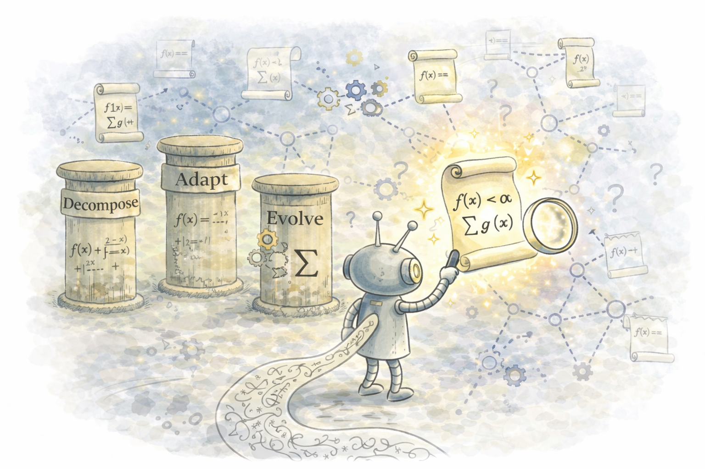

# `DevAEvolve`: Scientific Equation Discovery with `Decompose`, `Adapt`, and `Evolve`,

Official Implementation of paper [**DecAEvolve: Decompose, Adapt, and Evolve, or, Three Pillars of Effective Scientific Equation Discovery**](https://openreview.net/forum?id=nApMHaYSM6&referrer=%5Bthe%20profile%20of%20Parshin%20Shojaee%5D(%2Fprofile%3Fid%3D~Parshin_Shojaee1)).
This repository includes all code for data generation, training pipelines, and evaluation.





Offline GRPO training and symbolic regression experiments (CRK chemistry, oscillators, etc.).

## Where the job entrypoint lives

- **`decaevolve_job/`** — self-contained copy of the code that Slurm/local scripts run (`main.py` + `llmsr/` + `llm_engine/`). Prefer this; it is versioned in git. `main.py` resolves `data/` and relative `spec_path` against the **repository root** (parent of `decaevolve_job/`), or `DECAEVOLVE_REPO_ROOT` if set.
- **`external/decaevolve-llama/`** — optional legacy checkout (often gitignored). `scripts/run_crk_offline_grpo_atomsr_qwen7b.sh` uses `decaevolve_job/main.py` when present, else falls back to external.

## GitHub / sharing checklist

| Topic | Status |
|--------|--------|
| **Secrets** | `.hf_token`, `.wandb_api_key` are gitignored — never commit them. |
| **External code** | `external/decaevolve-llama/` is optional if `decaevolve_job/` is present. Older docs referred to unpacking external here. |
| **Large artifacts** | `logs/`, `wandb/`, `grpo_checkpoints/`, `data/` are not all ignored — **review** before `git add` (datasets can be large). Prefer documenting HF export instead of committing every CSV. |
| **Lockfile** | `requirements-lock.txt` pins the last known-good `pip` set (Linux, CUDA 12, `llmsr` conda env). Regenerate with `bash scripts/refresh_requirements_lock.sh` after upgrading packages. |
| **Platform** | Training is aimed at **Linux + NVIDIA GPU** (2 GPUs for CRK 7B + vLLM). macOS/CPU-only is not supported for the full GRPO+vLLM path. |

## Environment (frozen)

```bash
conda env create -f environment.yml
conda activate llmsr
pip install -r requirements-lock.txt
```

For a looser install (may drift): `pip install -r requirements.txt` then install `vllm` / `trl` per your CUDA stack.

## Refreshing `decaevolve_job/` from a private snapshot

If you still maintain `external/decaevolve-llama/decaevolve-llama/`, sync into the tracked folder (then re-apply the small `main.py` repo-root patch if you overwrite it):

```bash
rsync -a --delete external/decaevolve-llama/decaevolve-llama/llmsr/ decaevolve_job/llmsr/
rsync -a external/decaevolve-llama/decaevolve-llama/llm_engine/ decaevolve_job/llm_engine/
# merge main.py by hand — decaevolve_job/main.py adds DECAEVOLVE_REPO_ROOT / spec resolution
```

## CRK datasets (`data/crk{N}/`)

CSV layout: `train.csv`, `test_id.csv`, `test_ood.csv` with columns `t,A,dA_dt`.

Export from Hugging Face (dataset is **gated** — need access + `HF_TOKEN`):

```bash
export HF_TOKEN=...   # or use ~/.hf_token
pip install h5py pandas huggingface_hub
python scripts/export_crk_dataset_from_hf.py 22
```

## Run CRK offline GRPO + AtomSR + Qwen2.5-7B **without Slurm**

Requires **2 GPUs** (vLLM on one, training on the other). From repo root:

```bash
conda activate llmsr
export CUDA_VISIBLE_DEVICES=0,1
CRK_TAG=crk4 bash scripts/run_crk_offline_grpo_atomsr_qwen7b.sh
```

Optional: `HF_MODEL=...`, `N_PROMPTS=...`, `LLMSR_SKIP_CONDA=1` if your shell already has the env active.

Logs: `logs/local/<timestamp>/` for vLLM; training `log_path` under `logs/compare_*`.

## Slurm

```bash
CRK_TAG=crk4 sbatch compare_run_crk_offline_grpo_external_atomsr_qwen7b.sbatch
```

## Legacy quick start (root `main.py`)

```bash
pip install -r requirements.txt
# pip install vllm  # match your CUDA
CUDA_VISIBLE_DEVICES=0 python main.py --spec_path ./specs/specification_oscillator1_numpy.txt \
  --problem_name oscillator1 --use_offline_grpo True --grpo_learning_rate 1e-6 \
  --hf_model "Qwen/Qwen2.5-0.5B-Instruct"
```
